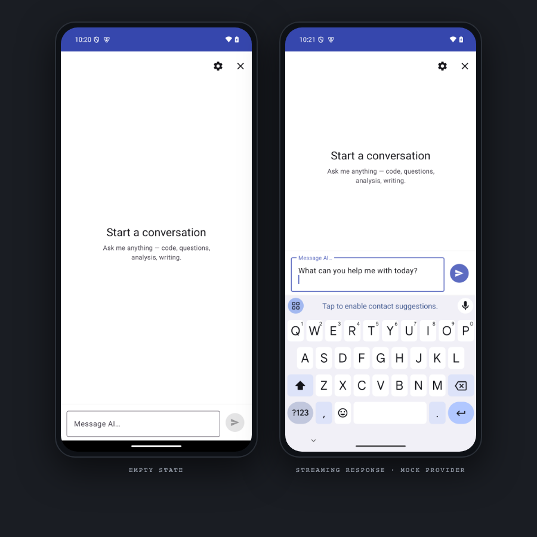

# AI Chat Assistant

> A native Android chat client for OpenAI-compatible LLM endpoints. Single-Activity, fragment-based, clean-architecture Java app with streaming responses, Room-backed local history, runtime model swap, and a built-in mock provider for offline development.

[-3DDC84)](https://developer.android.com)
[](https://www.java.com)
[](https://m3.material.io)
[](https://developer.android.com/training/data-storage/room)
[](#license)

A focused Android chat client that talks to the OpenAI `/chat/completions` API (or any compatible endpoint), persists every conversation locally with Room, and falls back to a mock streaming provider when no API key is configured — so the UI is fully driveable offline.

---

## Screenshots

<p align="center">
  
</p>

Real Android emulator captures (Pixel 8, API 34, headless) — empty state on the left, streaming response from the mock provider on the right. Built locally with `gradle 8.5 assembleDebug`, installed via `adb install`, screenshotted with `adb exec-out screencap -p`.

| Capture | Surface |
|---|---|
| [`01_empty_state.png`](Screenshots/01_empty_state.png) | Fresh launch — "Start a conversation" placeholder + Settings (gear) + Clear (X) action bar |
| [`02_chat_response.png`](Screenshots/02_chat_response.png) | User message + AI response bubble rendered through the same `Resource<Loading/Success/Error>` pipeline the real API uses |
| [`03_settings.png`](Screenshots/03_settings.png) | Settings bottom sheet — system prompt, API key, model picker, mock-provider toggle |

---

## Features

### Chat
- **Streaming responses** — AI text appears token-by-token through a typing-indicator row, then collapses into the final bubble.
- **Multi-turn history** — every user + assistant turn is persisted in Room and replayed on cold start.
- **Material 3 bubbles** — distinct user (primary blue) and AI (neutral grey) chat-bubble styles with `item_user_message.xml` / `item_ai_message.xml`.
- **Empty state** — "Start a conversation" placeholder when no history exists.
- **Clear chat** — wipe the conversation table from the action bar menu.

### Settings (bottom sheet)
- **System prompt** — customize the prompt prepended to every request.
- **API key** — paste at runtime; stored in `SharedPreferences` (not committed).
- **Model picker** — switch between `gpt-4o-mini`, `gpt-4o`, or any model the configured endpoint accepts.
- **Mock provider toggle** — drives `MockStreamingDataSource` instead of the real API for offline UI work.

### Architecture polish
- **Single-Activity + fragment** — `MainActivity` hosts `ChatFragment`; no navigation graph (one screen).
- **Clean architecture layering** — `data → domain → ui`, with `data/datasource`, `data/repository`, `data/local`, `data/model`, `data/api`, `domain/repository`, `domain/usecase`, `domain/model`.
- **Manual DI** — `ServiceLocator` lazily constructs Retrofit, Room DB, repositories, and use cases; no Dagger / Hilt.
- **ViewBinding everywhere** — no `findViewById`.
- **Network awareness** — `NetworkUtils` detects offline state and short-circuits to a friendly error before hitting the API.

---

## Architecture

```
┌──────────────────────────────────────────────┐
│              UI Layer                        │
│  MainActivity · ChatFragment · ChatAdapter   │
│  ChatViewModel · ChatViewModelFactory        │
│  SettingsBottomSheet                         │
└──────────────────────────────────────────────┘
                  ▲ LiveData
                  │
┌──────────────────────────────────────────────┐
│              Domain Layer                    │
│  ChatRepository (interface)                  │
│  Use cases · Message model                   │
└──────────────────────────────────────────────┘
                  ▲
                  │
┌──────────────────────────────────────────────┐
│              Data Layer                      │
│  ChatRepositoryImpl                          │
│  RemoteChatDataSource (Retrofit / OkHttp)    │
│  MockStreamingDataSource (offline fallback)  │
│  ChatDatabase + MessageDao + MessageEntity   │
│  ChatRequest / ChatResponse models           │
└──────────────────────────────────────────────┘
                  ▲
                  │
┌──────────────────────────────────────────────┐
│        Cross-cutting                         │
│  AIChatApp (Application)                     │
│  ServiceLocator (manual DI)                  │
│  AppConfig · Resource<T> · NetworkUtils      │
│  PromptBuilder · DateUtils                   │
└──────────────────────────────────────────────┘
```

Three rules every file obeys:
1. **Fragment / Activity contains presentation logic only** — no Retrofit, no Room access, no JSON parsing.
2. **`ChatRepository` is the single boundary** between UI and data — the UI never knows whether the response came from the real API or the mock provider.
3. **Brand decisions live in `res/values/colors.xml` and `themes.xml`** — no `Color.parseColor("#...")` literals in code.

### Folder structure

```
app/src/main/
├── AndroidManifest.xml             # AIChatApp + MainActivity, INTERNET + ACCESS_NETWORK_STATE
├── res/
│   ├── layout/                     # activity_main, fragment_chat,
│   │                               # item_user_message, item_ai_message,
│   │                               # item_typing_indicator, bottom_sheet_settings
│   ├── menu/                       # Action-bar overflow (clear chat, settings)
│   ├── drawable/                   # Bubble shapes, send icon
│   └── values/                     # colors · dimens · strings · themes
└── java/com/example/aichatassistant/
    ├── AIChatApp.java              # Application entry — initializes ServiceLocator
    ├── MainActivity.java           # Single host activity
    ├── common/
    │   ├── AppConfig.java          # Default model + base URL pulled from BuildConfig
    │   └── Resource.java           # Loading / Success / Error wrapper
    ├── di/
    │   └── ServiceLocator.java     # Manual DI singleton
    ├── utils/
    │   ├── NetworkUtils.java       # Online check
    │   ├── PromptBuilder.java      # Compose system + history + new turn
    │   └── DateUtils.java          # Timestamps for bubbles
    ├── data/
    │   ├── api/                    # Retrofit interface for /chat/completions
    │   ├── model/                  # ChatRequest, ChatResponse, ChatChoice, …
    │   ├── datasource/
    │   │   ├── RemoteChatDataSource.java    # Real OpenAI-compatible client
    │   │   └── MockStreamingDataSource.java # Offline streaming simulator
    │   ├── local/
    │   │   ├── ChatDatabase.java           # Room database
    │   │   ├── MessageDao.java             # Insert / observe / wipe
    │   │   └── MessageEntity.java          # @Entity
    │   └── repository/
    │       └── ChatRepositoryImpl.java     # Wires remote + mock + Room
    ├── domain/
    │   ├── repository/             # ChatRepository interface
    │   ├── model/                  # Message domain model
    │   └── usecase/                # SendMessageUseCase, ObserveMessagesUseCase, …
    └── ui/
        ├── chat/
        │   ├── ChatFragment.java
        │   ├── ChatViewModel.java
        │   ├── ChatViewModelFactory.java
        │   └── adapter/
        │       └── ChatAdapter.java        # RecyclerView with 3 view types
        └── settings/
            └── SettingsBottomSheet.java
```

---

## Design System

Single source of truth: [`app/src/main/res/values/colors.xml`](app/src/main/res/values/colors.xml) and [`themes.xml`](app/src/main/res/values/themes.xml).

| Token | Hex | Role |
|---|---|---|
| `primary` | `#5C6BC0` | Brand — toolbar tint, user bubble background |
| `primary_dark` | `#3949AB` | Status bar |
| `primary_container` | `#E8EAF6` | Soft brand washes |
| `surface` | `#FFFFFF` | Cards, bottom sheet |
| `background` | `#FAFAFA` | Window background |
| `user_bubble_bg` | `#5C6BC0` | User chat bubble |
| `ai_bubble_bg` | `#EBEBF5` | AI chat bubble |
| `status_error` | `#B00020` | Error banners |
| `divider_color` | `#E0E0E0` | List dividers |

Theme: `Theme.Material3.Light.NoActionBar` with the custom palette layered on top. Typography uses Material 3's default Roboto ramp. Spacing and radius tokens are declared in `dimens.xml`.

---

## Tech Stack

| Layer | Choice |
|---|---|
| UI | Activity + Fragment (single screen), ViewBinding, RecyclerView |
| Theme | Material 3 |
| State | `ViewModel` + `LiveData` |
| DB | Room — single `messages` table |
| Networking | Retrofit + OkHttp + Gson |
| Streaming | Server-Sent Events parsed in `RemoteChatDataSource` |
| DI | Manual `ServiceLocator` singleton (no Hilt) |
| Min SDK | 24 (Android 7.0) |
| Compile SDK | 34 (Android 14) |
| Java | 17 (`sourceCompatibility VERSION_17`) |

---

## Getting Started

### Prerequisites

- Android Studio Hedgehog (2023.1.1) or newer
- JDK 17 on `PATH`
- An emulator or device running Android 7.0 (API 24) or higher
- An OpenAI API key (or any OpenAI-compatible endpoint key) — optional, the mock provider works without one

### Configure the API key

The API key is read from `BuildConfig.OPENAI_API_KEY` (populated by `app/build.gradle`).

**Recommended:** move the key out of `build.gradle` into `~/.gradle/gradle.properties`:

```properties
# ~/.gradle/gradle.properties  (NOT committed)
OPENAI_API_KEY=sk-proj-...
```

Then in `app/build.gradle`:

```groovy
buildConfigField "String", "OPENAI_API_KEY", "\"${project.findProperty('OPENAI_API_KEY') ?: ''}\""
```

Until that change is in, the demo key in `app/build.gradle` is used.

> **Security note:** committing a real OpenAI key to `build.gradle` exposes it to anyone with read access to the repo. Rotate it at <https://platform.openai.com/api-keys> and move it to `gradle.properties` (or a CI secret) before pushing.

### Build and run

```bash
./gradlew assembleDebug

# Install on a connected device or running emulator:
ADB="$ANDROID_HOME/platform-tools/adb"
$ADB install -r app/build/outputs/apk/debug/app-debug.apk
$ADB shell am start -n com.example.aichatassistant/.MainActivity
```

Or open in Android Studio and press **Run ▶**.

### Run offline (mock provider)

1. Launch the app.
2. Overflow menu → **Settings**.
3. Enable **Use Mock Provider**.

The mock streams a canned response token-by-token through the same `Resource.Loading → Success` pipeline as the real API, so every UI state is reachable without network or credits.

---

## Configuration

Runtime config lives in `app/build.gradle` `buildConfigField`s and is exposed via `AppConfig`:

| Field | Default | Purpose |
|---|---|---|
| `OPENAI_API_KEY` | (from `gradle.properties`) | Bearer token for the `/chat/completions` request |
| `OPENAI_BASE_URL` | `https://api.openai.com/` | Swap for any OpenAI-compatible host |
| `DEFAULT_MODEL` | `gpt-4o-mini` | Initial model in Settings |

Per-user runtime overrides (system prompt, key, model, mock toggle) are persisted in `SharedPreferences` and read by `SettingsBottomSheet`.

---

## Tradeoffs

- **Manual `ServiceLocator` over Hilt.** Dependency graph is ~10 objects; manual DI reads top-to-bottom in one file. Hilt's annotation processor + generated code + `@HiltAndroidApp` / `@AndroidEntryPoint` ceremony is overhead at this scale. See [docs/decisions.md, ADR-001](docs/decisions.md#adr-001--manual-servicelocator-instead-of-hilt--dagger).
- **OkHttp directly for streaming.** Retrofit's `Call.execute()` buffers the full response before returning — defeats `stream: true`. The streaming path uses OkHttp directly with SSE chunk parsing line-by-line; Retrofit is the request-builder for non-streaming requests. See [ADR-004](docs/decisions.md#adr-004--okhttp-direct-for-streaming-retrofit-only-for-non-streaming).
- **Mock provider streams the same pipeline as the real one.** Not a canned `"Hello!"` — emits tokens through the same `Resource.Loading → Resource.Success` pipeline so every UX state (typing indicator, partial render, final-collapse) exercises offline. See [ADR-003](docs/decisions.md#adr-003--mock-provider-streams-the-same-pipeline-as-the-real-one).
- **`Resource<T>` wrapper over three booleans.** Mirrors the iOS sibling project's `ViewState<T>` pattern; invalid states (loading AND error AND data) unrepresentable.
- **Java 17, not Kotlin.** Project started in a Java-heavy course context; migration to Kotlin would be a separate refactor. Java 17 records + switch expressions + pattern matching cover most ergonomics.
- **API key loaded from `gradle.properties`, never hardcoded.** Build reads `OPENAI_API_KEY` from `~/.gradle/gradle.properties` or `System.getenv()`; empty fallback so the app builds and runs against the mock provider with no key. See [ADR-006](docs/decisions.md#adr-006--api-key-loaded-from-gradleproperties-never-hardcoded).

Full ADRs in [docs/decisions.md](docs/decisions.md).

---

## Quality Gates

- `./gradlew assembleDebug` passes against API 34, JDK 17.
- `./gradlew lintDebug` clean.
- `./gradlew testDebugUnitTest` runs the unit-test suite.
- No `findViewById` calls — ViewBinding everywhere.
- No `Color.parseColor("#...")` literals in code; brand decisions in `res/values/colors.xml` + `themes.xml`.
- No API keys in source — `.gitignore` excludes `local.properties`, `*.keys`, `secrets.properties`, `api_keys.properties`, `local.gradle.properties`.
- `Resource<T>` wrapper for all async streams — no scattered `isLoading` booleans.
- Streaming SSE parsed line-by-line; full-buffer Retrofit response only used for non-streaming endpoints.

---

## Project Stats

- **31** Java source files
- **3** architectural layers (UI · Domain · Data)
- **1** Activity, **1** primary Fragment + **1** bottom-sheet dialog
- **3** view types in `ChatAdapter` (user bubble, AI bubble, typing indicator)
- **1** Room table (`messages`)
- **2** data sources (`RemoteChatDataSource`, `MockStreamingDataSource`) behind one `ChatRepository`
- **0** Hilt / Dagger; manual DI via `ServiceLocator`
- **0** third-party UI libs beyond Material 3 + RecyclerView

## Roadmap

- Markdown rendering for AI bubbles (code blocks, lists, inline code) — roadmap Phase 2
- Conversation list — multiple chats in a left drawer — roadmap Phase 1
- Export conversation as Markdown
- Image input (vision models) — roadmap Phase 4
- Encrypted API key storage via AndroidX Security — roadmap Phase 3
- Tablet layout (chat list + detail pane) — roadmap Phase 5
- Light/dark theme toggle (currently `Theme.Material3.Light` only) — roadmap Phase 6
- Cancel in-flight stream on Fragment destruction

Full phased plan in [docs/roadmap.md](docs/roadmap.md).

---

## License

[MIT](LICENSE)

---

*Built by Kaustubha Eluri as a focused, dependency-light Android client for OpenAI-compatible chat APIs.*
